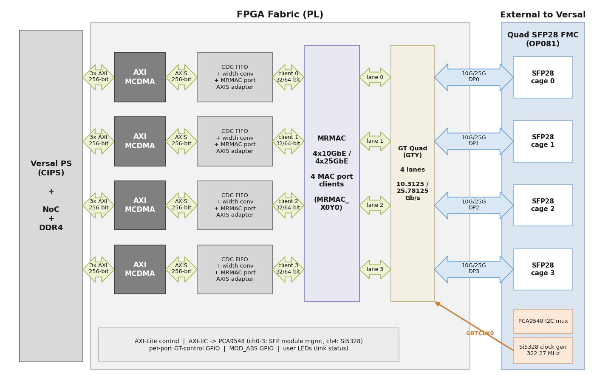

# Description

In this reference design, all four ports of the [Quad SFP28 FMC] are clients of a single Versal
[Integrated 100G Multirate Ethernet MAC (MRMAC)] hard block, configured for four independent
channels at 10GbE or 25GbE (one channel per SFP28 port, one GTY transceiver lane per channel).
Packet data is moved to and from system memory (DDR) by a per-port AXI MCDMA, through the Versal
NoC, and the ports are driven under PetaLinux by the AXI Ethernet (`xilinx_axienet`) driver. A
bare-metal echo-server test application is also included.

This contrasts with the Opsero [Quad SFP28 FMC (XXV)] reference design, which drives the same
mezzanine card with four instances of the soft 10G/25G Ethernet Subsystem IP. Here a single
integrated MRMAC replaces all four soft MACs — it consumes no fabric logic for the MAC/PCS and
needs only a free license — and the same hardware supports both line rates (the 10G and 25G
variants are separate build targets).

## Block diagram

* **MRMAC (4x10GE or 4x25GE).** The single MRMAC hard block (site `MRMAC_X0Y0`) is configured
  with the `4x10GE Wide` or `4x25GE Wide` preset: four independent MAC ports, each with its own
  64-bit non-segmented client interface (a 10GE port actively drives 32 bits of it, a 25GE port
  the full 64 bits), all running at the 390.625 MHz AXIS client clock.
* **GT Quad (GTY).** All four lanes of one `gt_quad_base` (FMC DP0–3 = SFP28 slots 0–3) serve one
  port each. The complete GT configuration is derived automatically from the connected MRMAC
  serdes interfaces by IP integrator parameter propagation: RAW encoding, LCPLL, 322.265625 MHz
  reference clock, TX/RXPROGDIV output clocks at 644.531 MHz. Each lane's TX and RX output clocks
  are buffered by a pair of free-running BUFG_GTs into full-rate and half-rate user clocks for
  that port.
* **MRMAC client AXIS adapters.** The MRMAC per-port client is not a standard AXI4-Stream bus —
  the data rides on loose 64-bit lane pins plus an 11-bit `tkeep_user` control word. Small custom
  RTL adapters (`mrmac_port_tx_axis_adapter` / `mrmac_port_rx_axis_adapter`) present each port's
  client as a standard AXI4-Stream at the port's active width.
* **Datapath to DDR.** Per port, a width converter (to 256 bits) and an asynchronous CDC FIFO
  bridge the 390.625 MHz MRMAC client clock domain to the 100 MHz system clock domain, where an
  AXI MCDMA moves packet data to and from DDR over three NoC AXI ports (scatter-gather, MM2S,
  S2MM).
* **Clocking.** The Si5328 jitter-attenuating clock generator on the FMC sources the GT reference
  clock (GBTCLK0) at 322.265625 MHz. It is programmed over I2C through the card's PCA9548 mux
  (channel 4; channels 0–3 are the SFP module management buses).
* **Control and sideband.** Per port, an AXI-Lite control path reaches the MCDMA and a GT-control
  AXI GPIO (which lets software reset that port's GT lane and read reset-done). Shared
  peripherals: the MRMAC AXI-Lite interface, one AXI IIC to the PCA9548 mux, a 4-bit MOD_ABS
  input GPIO (SFP module presence) and an APB3 bridge to the GT quad. The SFP `TX_DISABLE` lines
  are tied low (transmitter enabled from configuration), the `RS0`/`RS1` rate-select lines are
  tied low on the 10G targets and high on the 25G targets, and each slot's user LEDs show link
  status (green = module present and link up, red = module present and link down).

## Supported Hardware Platforms

The hardware design provided in this reference is based on Vivado and supports the AMD Versal
evaluation board(s) listed below. The repository contains all necessary scripts and code to build
the design for the supported platform(s):









### {{ group.name }} boards

| Carrier board    | Supported FMC connector(s) | 10G support | 25G support |
|------------------|----------------------------|-------------|-------------|
| [{{ name }}]({{ board.link }}) | {{ connector }}  |  ✅  Not supported  |  ✅  Not supported  |




The Quad SFP28 FMC requires a carrier board whose FMC connector routes four gigabit transceivers
(one per SFP28 port) capable of the line rate, and an AMD device that contains the integrated
MRMAC. The VCK190 satisfies both via its FMCP1 connector.

## Supported Software

This reference design can be driven within a PetaLinux environment, or by the included
bare-metal echo-server test application. The repository includes all necessary scripts and code
to build both. The table below outlines the corresponding applications available:

| Environment      | Available Applications  |
|------------------|-------------------------|
| Standalone       | Raw-Ethernet echo server (ARP, ICMP ping, UDP echo on all 4 ports) |
| PetaLinux        | Built-in Linux commands Additional tools: ethtool, iperf3, phytool Bundled self-test: `mrmac-loopback-test` |

[Quad SFP28 FMC]: https://docs.opsero.com/op081/datasheet/overview/
[Quad SFP28 FMC (XXV)]: https://sfp28-xxv.ethernetfmc.com
[Integrated 100G Multirate Ethernet MAC (MRMAC)]: https://www.amd.com/en/products/adaptive-socs-and-fpgas/intellectual-property/mrmac.html
