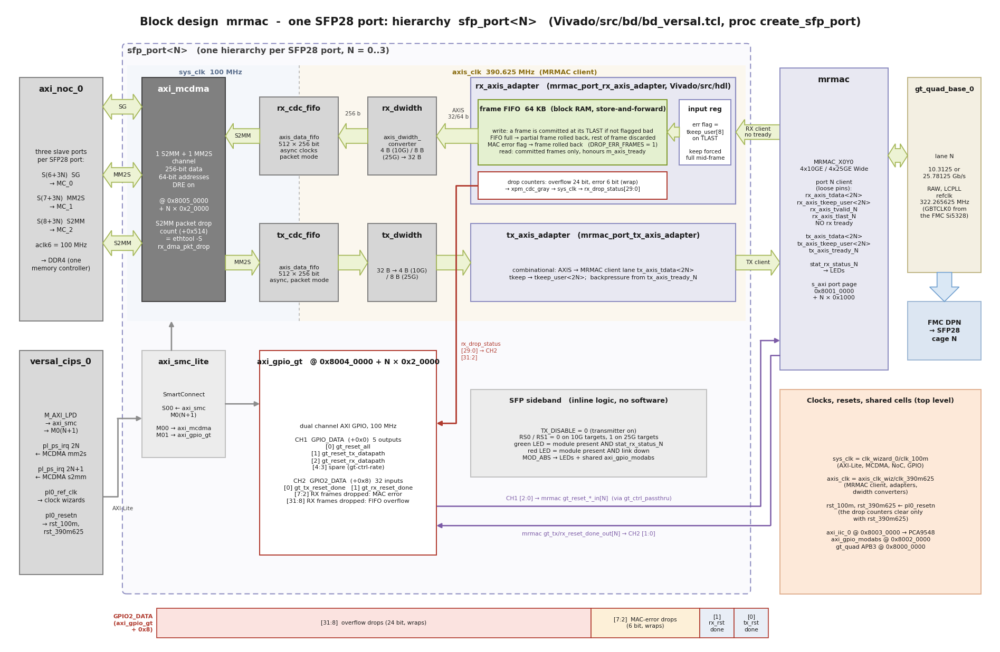

# Registers and counters

This page lists the registers and counters that are useful when running, testing and debugging
the design: the per-port GT-control GPIO with its RX drop counters, the MCDMA packet-drop count,
the MRMAC status registers used by the Linux link monitor, and the matching `ethtool`
statistics. The full address map is in the *Address and interrupt maps* section of
[Advanced](advanced).

All addresses below are physical addresses on the `M_AXI_LPD` bus and are identical for the 10G
(`vck190_fmcp1`) and 25G (`vck190_fmcp1_25g`) targets.

## Per-port base addresses

| SFP28 port | Linux interface | GT-control GPIO (`axi_gpio_gt`) | AXI MCDMA    | MRMAC port page |
|------------|-----------------|---------------------------------|--------------|-----------------|
| 0          | `eth0`          | `0x80040000`                    | `0x80050000` | `0x80010000`    |
| 1          | `eth1`          | `0x80060000`                    | `0x80070000` | `0x80011000`    |
| 2          | `eth2`          | `0x80080000`                    | `0x80090000` | `0x80012000`    |
| 3          | `eth3`          | `0x800A0000`                    | `0x800B0000` | `0x80013000`    |

The Linux interface names are the same in the PetaLinux and the Yocto images. The kernel log
names each port by its MRMAC port page, for example `xilinx_axienet 80011000.mrmac eth1`.

## GT-control GPIO (`sfp_port<N>/axi_gpio_gt`)

Each port has a dual-channel AXI GPIO. Channel 1 is used by the Linux driver to reset the port's
GT lane; channel 2 returns the GT reset-done status **and the RX drop counters of the port's
frame FIFO**.

| Offset | Register     | Direction | Width | Contents |
|--------|--------------|-----------|-------|----------|
| `0x0`  | `GPIO_DATA`  | output    | 5     | `[0]` gt_reset_all, `[1]` gt_reset_tx_datapath, `[2]` gt_reset_rx_datapath, `[4:3]` spare (`gt-ctrl-rate`) |
| `0x8`  | `GPIO2_DATA` | input     | 32    | see the bit layout below |

`GPIO2_DATA` (base + `0x8`), read-only:

| Bits     | Field              | Description |
|----------|--------------------|-------------|
| `[0]`    | `tx_reset_done`    | GT TX reset done for this port's lane (1 = done) |
| `[1]`    | `rx_reset_done`    | GT RX reset done for this port's lane (1 = done) |
| `[7:2]`  | MAC-error drops    | Number of received frames dropped because the MRMAC flagged them as bad (FCS error, undersize, ...). 6-bit counter, wraps from 63 to 0. |
| `[31:8]` | Overflow drops     | Number of received frames dropped because the 64 KB RX frame FIFO was full (or the frame was larger than the FIFO). 24-bit counter, wraps from 16777215 to 0. |



Notes on the drop counters:

* They are free-running and are **not** cleared by reading them, by `ip link set down/up` or by
  the link monitor's recovery resets. They are cleared only by the reset of the MRMAC client
  clock domain, i.e. when the device is reconfigured (power-on or reboot). To measure the drops
  of a test, read the register before and after and take the difference (modulo the counter
  width).
* Every frame they count was dropped **whole**: the frame FIFO never passes a truncated or
  merged frame to the DMA. A dropped frame looks to the protocol stack like a frame lost on the
  wire; TCP recovers it by retransmission.
* A reading of `0x00000003` (both reset-done bits set, both counters zero) is the normal state
  of a port that is up and has not lost any frames.
* MAC-error drops normally stay at zero on a good link. If they count, check the cabling and
  optics, and compare with the MRMAC's own error statistics.

### Reading the counters from Linux

The PetaLinux image has the BusyBox `devmem` command; the Yocto image has `devmem2`. Both need
root. To read port 0 (`0x80040000 + 0x8`):

```
# PetaLinux
sudo devmem 0x80040008 32

# Yocto
sudo devmem2 0x80040008 w
```

The following shell snippet reads and decodes the register of one port. It works in both images
(it uses `devmem2` when present and `devmem` otherwise):

```sh
port=1                                              # SFP28 port 0..3
addr=$(printf "0x%x" $((0x80040008 + port * 0x20000)))
if command -v devmem2 >/dev/null; then
    v=$(sudo devmem2 $addr w | grep -oE ': 0x[0-9A-Fa-f]+' | tail -1 | cut -c3-)
else
    v=$(sudo devmem $addr 32)
fi
v=$((v))
echo "port $port: tx_reset_done=$((v & 1)) rx_reset_done=$(((v >> 1) & 1))" \
     "mac_error_drops=$(((v >> 2) & 0x3F)) overflow_drops=$(((v >> 8) & 0xFFFFFF))"
```

For example, a value of `0x0019E003` read from port 1 decodes as both reset-done bits set, 0
MAC-error drops and `0x19E0` = 6624 overflow drops.

## MCDMA S2MM packet drops (`rx_dma_pkt_drop`)

The AXI MCDMA drops a whole incoming frame when the Linux driver has no free RX buffer
descriptor for it. Such frames never reach the driver, so they do not appear in the interface's
`rx_dropped` or `rx_errors` statistics. The design's kernel reads the MCDMA's S2MM packet-drop
status register (`S2MM_PKTDROP_STAT`, MCDMA base + `0x514`) and reports it in `ethtool -S` as
**`rx_dma_pkt_drop`**:

```
$ sudo ethtool -S eth0 | grep -E "err|drop"
     tx_errors: 0
     rx_errors: 0
     rx_dma_pkt_drop: 0
```

`rx_dma_pkt_drop` is a 32-bit total for the port's MCDMA, free-running since the last reset of
the DMA. Reading it has no side effect, and it reads 0 while the interface is down. It is the same value as the register itself, e.g. for port 0
`sudo devmem2 0x80050514 w`.

To make descriptor starvation rare, the MRMAC ports default to an RX descriptor ring of **1024**
entries (the driver's default for other MAC types is 128):

```
$ sudo ethtool -g eth0
Ring parameters for eth0:
Pre-set maximums:
RX:			4096
...
TX:			4096
...
Current hardware settings:
RX:			1024
...
TX:			128
```

The ring can be changed with `ethtool -G <iface> rx <n>` while the interface is down.

## Where a lost frame is counted

Received frames can be dropped at three places in this design. Together with the MAC and
network-stack counters they account for every frame:

| Where | Cause | Counter |
|-------|-------|---------|
| MRMAC | bad frame (FCS error, undersize, ...), dropped by the frame FIFO | `GPIO2_DATA[7:2]` (MAC-error drops) |
| RX frame FIFO | FIFO full: the DMA path did not keep up with the line rate | `GPIO2_DATA[31:8]` (overflow drops) |
| AXI MCDMA | no free RX descriptor: the CPU did not refill the ring in time | `ethtool -S` `rx_dma_pkt_drop` |
| Linux network stack | socket receive buffer full (receiving application too slow) | `nstat` `UdpRcvbufErrors`, `TcpExt*Drop*` (Yocto image) |

## MRMAC status registers (link state)

The Linux link monitor (see [Testing the design](testing.md#link-bring-up-and-the-link-monitor))
decides whether a port is up from three status registers in the port's MRMAC register page
(`0x80010000 + N × 0x1000`):

| Offset  | Register                  | Bits | Latching |
|---------|---------------------------|------|----------|
| `0x744` | RX status (`rx_sts`)      | `[0]` RX status good; `[7]` local fault; `[8]` internal local fault; `[9]` received local fault | `[0]` latches low |
| `0x754` | RX block lock (`blk_lck`) | `[0]` RX block lock (1 = locked) | latches low |
| `0x7B8` | RX valid control code (`vld_ctrl`) | `[0]` a valid control code was received | latches high |

The status bits are latched and are cleared by writing all-ones. The link monitor clears and
re-reads them on every poll, and logs their raw values (`rx_sts`, `blk_lck`, `vld_ctrl`) in its
`link down` and `link still down` messages. A port is considered up only when block lock, RX
status and (at 10G/25G) a recent valid control code are all present.

To read them by hand, clear first, wait, then read — for example for port 0:

```
# devmem 0x80010754 32 0xffffffff; sleep 0.5; devmem 0x80010754
# devmem 0x80010744 32 0xffffffff; sleep 0.5; devmem 0x80010744
```

(use `devmem2 <addr> w 0xffffffff` / `devmem2 <addr> w` in the Yocto image). The link monitor
also clears these registers, so a single manual reading can be disturbed; repeat it a few times.
